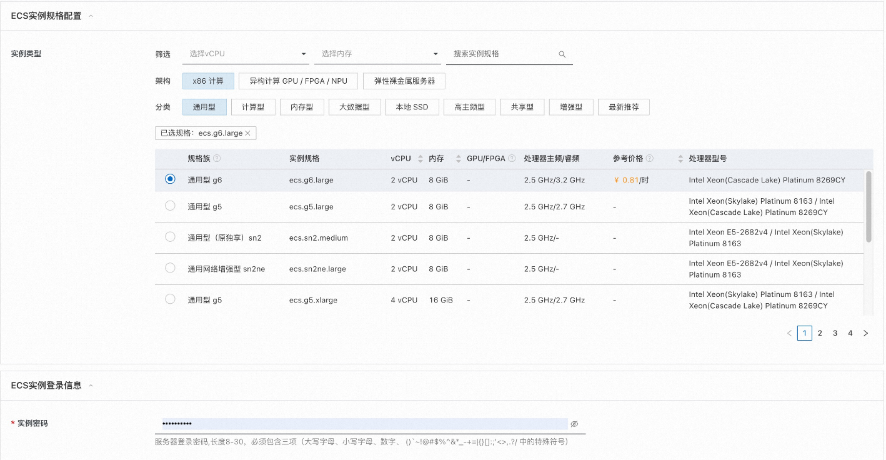
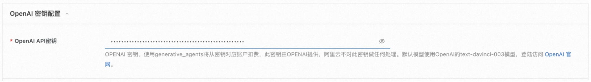
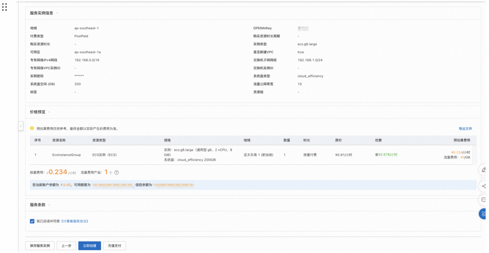
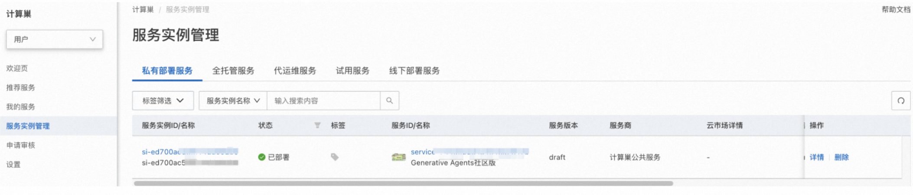
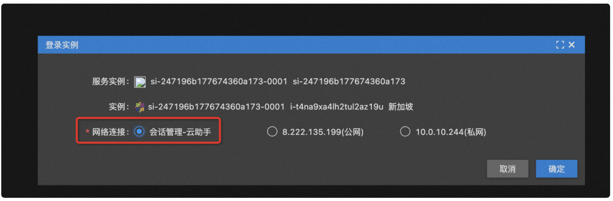
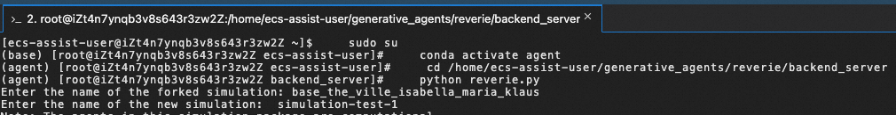

# Generative Agents社区版部署文档

## 概述
Generative Agents社区版是基于2023年4月美国斯坦福大学和Google Research所属的研究人员发表的论文“Generative Agents: Interactive Simulacra of HumanBehavior”的开源代码部署的服务。这项研究通过使用ChatGPT等技术，模拟了25个角色在一个虚拟世界中一起生活的情景。这些角色具有不同的虚构人格，并通过自发的行动展开活动。他们在一个复古RPG游戏风格的环境中，拥有各自独立的生活模式，从日常起床、工作到玩耍等。角色之间可以通过自然语言进行交流，并通过相遇和对话交换信息并形成记忆。  
在一项评估中，这些生成的代理人产生可信的个人和紧急的社会行为：例如，从一个用户指定的概念开始一个代理人想要举办情人节聚会，这些代理人在接下来的两天里主动地向聚会发出邀请，结交新的熟人，在聚会上互相约约，并协调在合适的时间一起参加聚会。 论文证明，通过融合大型语言模型与计算，交互代理，这项工作引入了建筑和交互模式使可信的模拟人类行为。
计算巢目前已上架了基于开源代码的Generative Agents，您只需在创建页选配好云服务器（ECS）参数，计算巢将自动为您创建带有Generative Agents的云服务器。创建完成后，您只需登陆ECS即可使用体验Generative Agents虚拟社区。本文向您介绍如何开通计算巢上的Generative Agents服务以及部署流程和使用说明。使用期间若发现任何问题，欢迎反馈交流。

## 实例说明

Generative Agents部署的为社区开源版本，源码参考[Github Repo](https://github.com/joonspk-research/generative_agents)。

## 部署流程

### 0. 准备工作

在正式开始使用前，您需要一个阿里云账号，对ECS、VPC等资源进行访问和创建操作。

- 若您使用个人账号，可以直接创建服务实例
- 若您使用RAM用户创建服务实例，且是第一次使用阿里云计算巢
    - 需要在创建服务实例前，对使用的RAM用户的账号添加相应资源的权限。添加RAM权限的详细操作，请参见[为RAM用户授
      权](https://help.aliyun.com/document_detail/121945.html)。所需权限如下表所示。
    - 且需要授权创建关联角色，参考下图，选中 **同意授权并创建关联角色**

| 权限策略名称                    | 备注                                    |
|---------------------------------|---------------------------------------|
| AliyunECSFullAccess             | 管理云服务器服务（ECS）的权限             |
| AliyunVPCFullAccess             | 管理专有网络（VPC）的权限                 |
| AliyunROSFullAccess             | 管理资源编排服务（ROS）的权限             |
| AliyunComputeNestUserFullAccess | 管理计算巢服务（ComputeNest）的用户侧权限 |
| AliyunCloudMonitorFullAccess    | 管理云监控（CloudMonitor）的权限          |

其次，由于Generative Agents底层调用了OpenAI的text-davinci-003模型，因此还需要您提前注册OpenAI的账号，此账号具有调用OpenAI API的权限。

### 1. 部署入口

您可以在阿里云计算巢自行搜索“Generative Agents社区版”，也可以通过下述部署链接快速到达。

[部署链接](https://computenest.console.aliyun.com/user/cn-hangzhou/serviceInstanceCreate?ServiceId=service-744d0d3d4a4548a2812b)=

### 2. 创建Generative Agents服务实例

#### 2.1 参数列表

您在创建服务实例的过程中，需要配置服务实例信息的参数列表，具体如下。

| 参数组        | 参数项         | 示例           | 说明                                                                                                                               |
|------------|-------------|--------------|----------------------------------------------------------------------------------------------------------------------------------|
| 服务实例名称     | N/A         | test         | 实例的名称                                                                                                                            |
| 地域         | N/A         | 华东1（杭州）      | 选中服务实例的地域，建议就近选中，以获取更好的网络延时。                                                                                                     |
| 付费类型配置     | 付费类型        | 按量付费         | 按实际情况选择付费类型                                                                                                                      |
| ECS实例配置    | 实例类型        | ecs.g6.large | 按实际情况选择实例规格                                                                                                                      |
| ECS实例登录信息  | 实例密码        | ********     | 设置实例密码。长度8~30个字符，必须包含三项（大写字母、小写字母、数字、 ()`~!@#$%^&*_-+={}[]:;'<>,.?/                                                              |
| OpenAI 密钥配置   | OpenAI Key   | sk-xxx       | OpenAI 密钥，使用Generative Agents将从密钥对应账户扣费，此密钥由OpenAI提供，阿里云不对此密钥做任何处理。默认使用text-davinci-003模型，登陆访问 [OpenAI 官网](https://openai.com/)。 |
| 可用区配置      | 可用区         | 可用区I         | 地域下的不同可用区域，确保实例非空                                                                                                                |
| VPC设置      | 是否新建VPC     | 是            | 若是，计算巢将自动创建VPC和Vswitch，若否，则需要填入已经创建好的VPC和Vswitch                                                                                 |
| VPC设置 | 专有网络VPC实例ID | vpc-xxx      | 按实际情况，选择专有网络的ID。                                                                                                                 |
| VPC设置 | 交换机实例ID     | vsw-xxx      | 按实际情况，选择交换机ID。若找不到交换机, 可尝试切换地域和可用区。                                                                                              |

#### 2.2 具体步骤

创建服务按如下步骤进行:

- 创建服务实例，填写服务实例名称（非必填）
- 选择地域，如下图中“新加坡”


- 选择实例类型: 默认选择ecs.g6.large
- 配置实例的密码


- OpenAI密钥配置：输入OpenAI账号所对应的OpenAIKey，格式为“sk-……”。计算巢仅将此OPENAIKey传入Generative Agents作为调用API凭证，不会执行如记录、校验、鉴权等任何操作。为保证后续正常使用，请保证此Key所对应账号具有访问权限且余额充足。

- 选择部署区域，如下图中“可用区A”

- VPC设置：可选新建或填入已有VPC/Vswitch


- 点击下一步，进入订单确认页面
- 勾选“我已阅读并同意《计算巢服务协议》”中的复选框
- 点击左下角立即创建，即可创建服务实例


### 3. 启动Generative Agents服务

查看服务实例：服务实例创建成功后，部署时间需要1～2分钟。部署完成后，页面上可以看到对应的服务实例，如下图


点击该服务实例可进入服务实例详情。


点击登录地址可以在浏览器看到如下界面，此时表示前端服务已经成功启动：


接下来需要通过命令行交互式方式启动后端服务，首先需要登陆Ecs实例中，点击：资源-远程连接-免密登陆：


选择会话管理-云助手后点击确定，即可进入ECS：


进入实例后执行以下命令启动后端模拟器服务:
```
    sudo su
    conda activate agent
    cd /home/ecs-assist-user/generative_agents/reverie/backend_server
    python reverie.py
```
执行成功后会看到如下输出,出现命令行提示符，询问以下内容：" "Enter the name of the forked simulation: ":

要启动一个包含Isabella Rodriguez、Maria Lopez和Klaus Mueller的3个代理的模拟，请输入以下内容：
```
base_the_ville_isabella_maria_klaus
```
然后将提示："Enter the name of the new simulation:"。输入任何名称来表示您当前的模拟（例如，只输入"mytest-simulation"即可）,注意每次启动需要输入不同的名字，否则会启动失败。
如果想输入一个已经存在的名称且能正常启动，需要提前删除
/home/ecs-assist-user/generative_agents/environment/frontend_server/storage目录下已经创建过的同名文件夹。
```
simulation-test-1
```
在您的浏览器上，导航到http://{{实例公网IP}}:8000/simulator_home。您应该可以看到Smallville的地图，以及地图上活动代理的列表。您可以使用键盘箭头在地图上移动。请保持此标签打开。要运行模拟，请在响应“输入选项”提示时在您的模拟服务器中键入以下命令。
```
run <step-count>
```
请注意，您需要将上述的替换为表示您想要模拟的游戏步骤数量的整数。例如，如果您想要模拟100个游戏步骤，您应该输入run 100。一个游戏步骤代表游戏中的10秒时间。 您的模拟应该在运行中，您将在浏览器中看到代理在地图上移动（您可以通过键盘上下左右按键查看地图）。一旦模拟运行完成，"Enter option"提示将重新出现。此时，您可以通过重新输入run命令并输入您想要的游戏步骤来模拟更多的步骤，通过输入exit来退出模拟而不保存，或者通过输入fin来保存并退出。 下次运行模拟服务器时，您可以通过将您的模拟名称作为forked simulation提供，来访问保存的模拟。这将允许您从离开的地方重新启动模拟。

### 更多功能
- 请参考[Generative Agents GitHub官方文档](https://github.com/joonspk-research/generative_agents)
